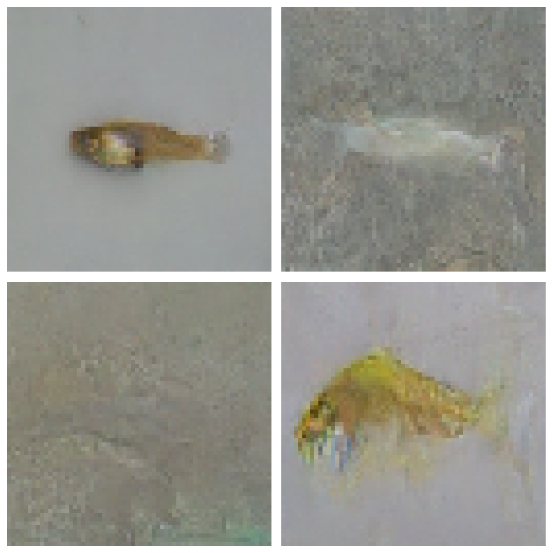
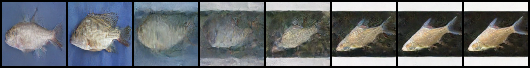
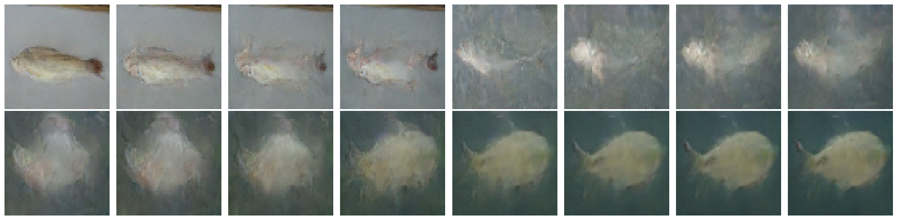

# Fish Image Generation with Denoising Diffusion Probabilistic Models

## Project Overview

This project implements a Denoising Diffusion Probabilistic Model trained on a Kaggle fish dataset to generate novel 64×64 fish images from pure noise. The pipeline covers the full lifecycle: data preprocessing with HuggingFace Datasets, an offset cosine noise schedule for stable forward diffusion, a custom UNet with self-attention for noise prediction, and both DDPM and DDIM reverse sampling for image generation. The model was trained on GPU with Exponential Moving Average weight smoothing and cosine-annealed learning rates across thousands of epochs, producing recognizable fish images with correct color, shape, and background structure.

### 4 Example Generated Images

  

**Hyperparameter Optimization:** A grid search framework was used to sweep over learning rate, batch size, weight decay, and gradient clipping. Each configuration was trained independently, with per-epoch losses logged to JSON/CSV files and generated samples saved at regular intervals for visual inspection. The initial grid search trained each model for 300 epochs on 10% of the dataset to quickly compare configurations. However, this was not enough for the models to learn meaningful image structure, and many configurations produced samples that were completely white or black. To improve learning, the training length was increased to 1000 epochs, and the number of diffusion time samples was increased from 1000 to 5000. The best-performing configurations were then selected based on trailing-average loss and sample quality, and the strongest model was trained further for 5000 epochs. Two learning rates were tested extensively and 1e-5 was chosen as a smaller ;earning rate would help prevent gradient explosion.

## Extra Criteria Pursued

**Latent Space Exploration:** Two interpolation methods are implemented: noise-space interpolation between real images using spherical linear interpolation with shared noise for temporal consistency, and a DDIM-based interpolation between generated images that walks smoothly through the model's learned latent manifold. Both produce multi-frame transition sequences visualized as image grids.

### Example real image interpolation

  

### Example generated image interpolation

  

## Difficulties Faced and Solutions

**Collapsed samples (all-white or all-black images):** The most persistent issue was that generated images saturated to solid white or black. Debug statistics revealed the reverse sampling process was drifting far outside the training data range of [−1, 1] — values reached ±10 by the final timestep. The root cause was twofold: the sinusoidal time embedding multiplied a `torch.long` tensor without casting to float, producing garbled embeddings that prevented the model from distinguishing timesteps; and the intermediate clamp of [−10, 10] was far too loose to prevent drift. Fixing the float cast (`t[:, None].float()`) and tightening the clamp to [−1.5, 1.5] resolved the issue.

**Blurry outputs with no structural coherence:** Early successful (non-white) samples showed correct color distributions but no fish shapes — just colored textures. This was caused by the purely convolutional UNet having no mechanism to coordinate information across distant spatial locations. Adding self-attention layers at the lower-resolution feature maps (enc3, enc4, bottleneck, dec3, dec4) allowed the model to reason about global structure and produce coherent fish shapes.
